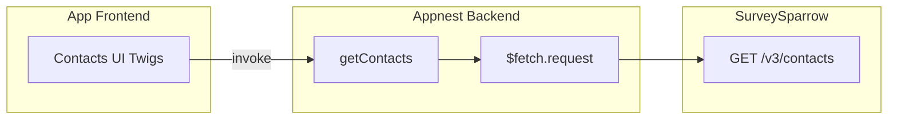

# SurveySparrow Contact Export — Technical Architecture

## AppNest alignment (mandatory)

This app follows the AppNest framework. Reference: `appnest-ai-context/appnest-governance/` (entry points, **Appnest Functions**, manifest, UI libraries).

### Backend

- **Single entry:** `app-backend/server.js`. Only **exported** functions are invokable (as API or event handlers).
- **No Express/routes:** Implement handlers in modules (e.g. `controller/contacts.js`) and re-export from `server.js`.
- **All I/O via Appnest Functions (backend):** Use **`$fetch.request`** for SurveySparrow HTTP; **`$db`** only if v1 adds prefs (optional—not required for MVP). Do **not** use axios/fetch. See **`Backend-Appnest-Functions.md`** in governance.
- **Do not add** `@sparrowengg/appnest-app-sdk-utils` to `app-backend/package.json`.
- **Handlers** receive `{ payload }` and return a plain object or **`ResultData({ body, statusCode })`** for errors.

### Frontend

- **Stack:** React root at **`app-frontend/src/App.jsx`**.
- **Backend calls:** `window.appnestClientFunctions.appBackend.invoke({ apiFunctionName, payload })` with `apiFunctionName` matching **manifest `backend_api_functions`** and **server.js** exports.
- **Do not add** `react` or `react-dom` to `app-frontend/package.json`.
- **UI:** **`@sparrowengg/twigs-react`** and **`@sparrowengg/twigs-react-icons`** at version **`"*"`** in `app-frontend/package.json`.

### Manifest

- **`backend_api_functions`:** `getContacts` (required); optional `getContactLists` if filter UI loads list IDs from API.
- **`event_listener_functions`:** **Omit** or empty for v1.
- **`whitelisted_domains`:** SurveySparrow API host(s) only.
- **`installation_params`:** SurveySparrow API key (product-bound).
- **`oauth_config`:** **Not required** for v1 if using Private App token from installation.

---

## High-level architecture



The **frontend** owns **CSV assembly** and download for selected rows. The **backend** validates payload, attaches **Authorization** from installation context, calls SurveySparrow, and returns JSON the UI can render.

## Backend layout

```
app-backend/
├── server.js              # Exports: getContacts, (+ getContactLists optional)
├── controller/
│   └── contacts.js       # Request mapping, response normalization
├── helpers/
│   └── surveysparrow.js  # Base URL, path building, error mapping
├── constants/
│   └── index.js          # Paths, limits
└── package.json
```

## Frontend layout

```
app-frontend/
└── src/
    ├── App.jsx
    ├── components/       # e.g. ContactsTable, Toolbar, ExportButton
    ├── hooks/            # e.g. useContactsQuery (debounced search)
    ├── utils/
    │   └── csv.js        # buildCsv(contacts, columns)
    └── css/
```

## External dependencies

- **SurveySparrow REST API v3** — `GET /v3/contacts` ([developers.surveysparrow.com](https://developers.surveysparrow.com/rest-apis/get-v-3-contacts)); optional **`GET` contact lists** if filter UI requires list picker.
- **Network:** HTTPS only; domain allowlisted in manifest.

## Security and secrets

- **No hardcoded secrets.** API token via **`installation_params`** (`data-bind` to product API key where applicable).
- **PII:** Contact payloads may contain emails, phone numbers, custom properties—**do not log** full bodies at info level; follow governance checklist for external API and logging.
