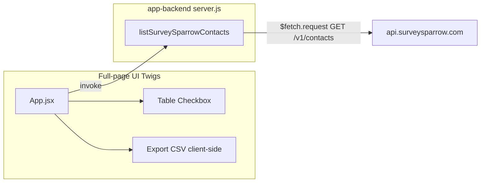

# SurveySparrow Contact CSV Export — Technical Architecture

## AppNest alignment (mandatory)

This app follows the AppNest framework. Reference: `appnest-ai-context/appnest-governance/` (entry points, **Appnest Functions**, manifest, UI libraries).

### Backend

- **Single entry:** `app-backend/server.js`. Only **exported** functions are invokable (as API or event handlers).
- **No Express/routes:** The framework provides routing. Implement handlers in separate files (e.g. `controller/contacts.js`) and re-export from `server.js`.
- **All I/O via Appnest Functions (backend):** Use `$fetch.request` for outbound HTTP to SurveySparrow. **No `$db` persistence required for v1** (read-only listing). Use `getTraceId()` for logging/correlation on errors. Do **not** use axios/fetch. See **`appnest-governance/appnest-functions/Backend-Appnest-Functions.md`**.
- **Do not add** `@sparrowengg/appnest-app-sdk-utils` to `app-backend/package.json`.
- **Handlers** receive `{ payload }` and return a plain object or `ResultData({ body, statusCode })`. Map SurveySparrow errors to clear `body` messages and appropriate status codes.

### Frontend

- **Stack:** React application; React and react-dom are provided by the platform.
- **Single entry:** `app-frontend/src/App.jsx` is the root component.
- **Backend calls:** `window.appnestClientFunctions.appBackend.invoke({ apiFunctionName: 'listSurveySparrowContacts', payload })`.
- **Do not add** `react` or `react-dom` to `app-frontend/package.json`.
- **UI components:** **`@sparrowengg/twigs-react`** and **`@sparrowengg/twigs-react-icons`** with version **`"*"`** in `package.json`.

### Manifest

- **backend_api_functions:** `listSurveySparrowContacts` with timeout ≤ 20s (external API latency).
- **event_listener_functions:** Omit or empty for v1.
- **whitelisted_domains:** `https://api\\.surveysparrow\\.com(/.*)?`
- **installation_params:** Product-bound SurveySparrow API key (secure, required).
- **oauth_config:** Omit for v1 (not used).
- **parent_product:** `surveysparrow`

---

## High-level architecture



## Backend layout

```
app-backend/
├── server.js              # Exports listSurveySparrowContacts
├── controller/
│   └── contacts.js        # Build URL/query; call $fetch; normalize response
├── constants/
│   └── surveysparrow.js    # Base URL path constants (optional)
└── package.json           # App-specific deps only; NOT appnest-app-sdk-utils
```

## Frontend layout

```
app-frontend/
└── src/
    ├── App.jsx
    ├── components/
    │   └── ContactsToolbar.jsx   # Search, pagination controls, Export Button
    ├── utils/
    │   └── csv.js                # Row objects → CSV string + download helper
    └── css/
```

## External dependencies

- **SurveySparrow REST API** — `GET https://api.surveysparrow.com/v1/contacts` (Bearer token). See [SurveySparrow API — Get Contacts](https://developers.surveysparrow.com/rest-apis/v1/get-v-1-contacts).

## Security and secrets

- API token supplied only via **installation_params** (product API key binding). Never log token or PII at info level; use trace id for support.
