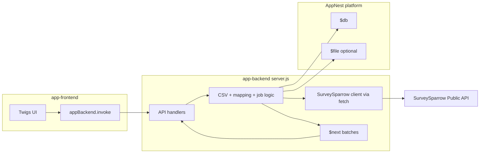

# Survey Response CSV Import — Technical Architecture

## AppNest alignment (mandatory)

This app follows the AppNest framework. Reference: `appnest-ai-context/appnest-governance/` (entry points, **Appnest Functions**, manifest, UI libraries).

### Backend

- **Single entry:** `app-backend/server.js`. Only **exported** functions are invokable (as API or event handlers).
- **No Express/routes:** Implement handlers in modules (e.g. `controller/importController.js`, `services/surveySparrowClient.js`) and re-export from `server.js`.
- **All I/O via Appnest Functions (backend):** `$db` for job state and idempotency markers; `$fetch.request` for SurveySparrow API; `$file` if CSV is staged in file storage; `$next` for **batched row processing** to stay within handler timeouts; `$schedule` optional for deferred work; `getTraceId()` for correlation. Do **not** use axios/fetch or raw DB clients.
- **Do not add** `@sparrowengg/appnest-app-sdk-utils` to `app-backend/package.json`.
- **Handlers** receive `{ payload }` and return plain objects or `ResultData({ body, statusCode })`.

### Frontend

- **Single entry:** `app-frontend/src/App.jsx`.
- **Backend calls:** `window.appnestClientFunctions.appBackend.invoke({ apiFunctionName, payload })` for each function in `manifest.json` → `backend_api_functions`.
- **Do not add** `react` or `react-dom` to `app-frontend/package.json`.
- **UI:** `@sparrowengg/twigs-react` + `@sparrowengg/twigs-react-icons` with version `"*"` in package.json.

### Manifest

- **`backend_api_functions`:** One entry per exported API; timeouts sized for largest call (list surveys vs. single batch—prefer small batch functions with `$next` chaining).
- **`whitelisted_domains`:** Include SurveySparrow API host (regex), e.g. `https://api\\.surveysparrow\\.com(/.*)?`.
- **`installation_params`:** At minimum, secure API key for SurveySparrow; remove unused OAuth/Snowflake-style params from template manifest when shipping this app.
- **`frontend_locations.full_page_app`:** Points to app bundle (`index.html`).

---

## High-level architecture



## Backend layout

```
app-backend/
├── server.js                 # Exports: listSurveys, getSurveyQuestions, ingestCsv, validateMapping, startImportJob, getImportJobStatus, processImportBatch, cancelImportJob
├── controller/               # Optional: thin handlers
├── services/
│   ├── csvParse.js
│   ├── surveySparrow.js      # $fetch wrappers, auth header from installation context
│   └── importJob.js          # state machine, row iterator, idempotency
├── helpers/
└── package.json
```

## Frontend layout

```
app-frontend/
└── src/
    ├── App.jsx
    ├── components/
    │   ├── CsvUpload.jsx
    │   ├── SurveySelect.jsx
    │   ├── MappingTable.jsx
    │   └── ImportProgress.jsx
    ├── hooks/
    └── utils/
```

## External dependencies

- **SurveySparrow Public API** (`api.surveysparrow.com`): list surveys, get survey / questions, create submission or equivalent endpoint(s) per official docs. PRD assumes REST + JSON; exact paths and payload shapes are fixed at implementation time against current API version.

## Security and secrets

- SurveySparrow credentials only through **installation_params** (secure). Backend builds Authorization header inside handlers; never return secrets to frontend.
- CSV may contain PII—treat `$file` objects or `$db` blobs with least retention: delete artifacts after job completion or TTL policy (documented in 07-data-model).
