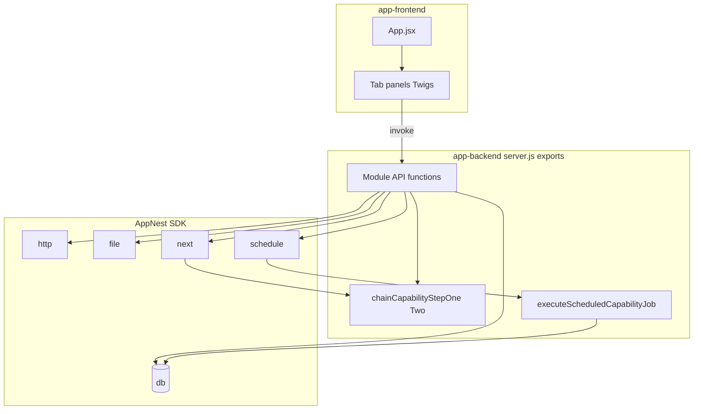

# Core Capability Lab — Technical Architecture

## AppNest alignment (mandatory)

This app follows the AppNest framework. Reference: `appnest-ai-context/appnest-governance/` (entry points, SDK, manifest, UI libraries).

### Backend

- **Single entry:** `app-backend/server.js`. Only **exported** functions are invokable (as API or scheduler targets).
- **No Express/routes:** Implement handlers in modules (e.g. `controller/capabilityLab.js`) and re-export from `server.js`.
- **All I/O via AppNest SDK:** `$db` for persistence, `$fetch` for outbound HTTP, `$file` for files, `$next` for chained invokes, `$schedule` for delayed/scheduled work. **No** axios/fetch.
- **Do not add** `@aravinthan_p/appnest-app-sdk-utils` to `app-backend/package.json`.
- **Handlers** receive `{ payload }` and return a plain object or `ResultData({ body, statusCode })`.

### Frontend

- **Stack:** React provided by the platform.
- **Single entry:** `app-frontend/src/App.jsx`.
- **Backend calls:** `window.appnestClientFunctions.appBackend.invoke({ apiFunctionName, payload })` only.
- **Do not add** `react` or `react-dom` to `app-frontend/package.json`.
- **UI:** `@sparrowengg/twigs-react` and `@sparrowengg/twigs-react-icons` with version **`"*"`** in `package.json`.

### Manifest

- **backend_api_functions:** Every export invoked by UI, `$next`, or `$schedule` must appear with `timeout` (seconds).
- **event_listener_functions:** Empty for v1 (no platform events).
- **whitelisted_domains:** Must include the host used by `runNetworkModuleTest` (SurveySparrow API).
- **installation_params:** Optional v1; none required if network demo uses fixed whitelisted path.
- **oauth_config:** Not used in v1.

---

## High-level architecture



## Backend layout

```
app-backend/
├── server.js                 # Re-exports all invokable functions
├── controller/
│   └── capabilityLab.js      # Module tests + helpers (appendRun, etc.)
├── helpers/                  # (optional) formatting, constants
└── package.json              # No AppNest SDK package
```

## Frontend layout

```
app-frontend/
└── src/
    ├── App.jsx
    ├── components/
    │   ├── CapabilityLabLayout.jsx
    │   └── ModulePanels/     # One panel per tab
    ├── utils/
    │   └── client.js
    └── css/
```

## External dependencies

- **Outbound HTTP (v1):** Only **GET** (or HEAD if needed) to **`https://api.salesparrow.com`** with a documented path (e.g. lightweight public or health-style endpoint—exact path to be chosen at implementation to match product policy). No other hosts in v1.

## Security and secrets

- No hardcoded API keys. Network demo uses **whitelisted** public API surface only.
- Lab data in `$db` may contain **non-PII** diagnostic strings only; do not log secrets or tokens.
